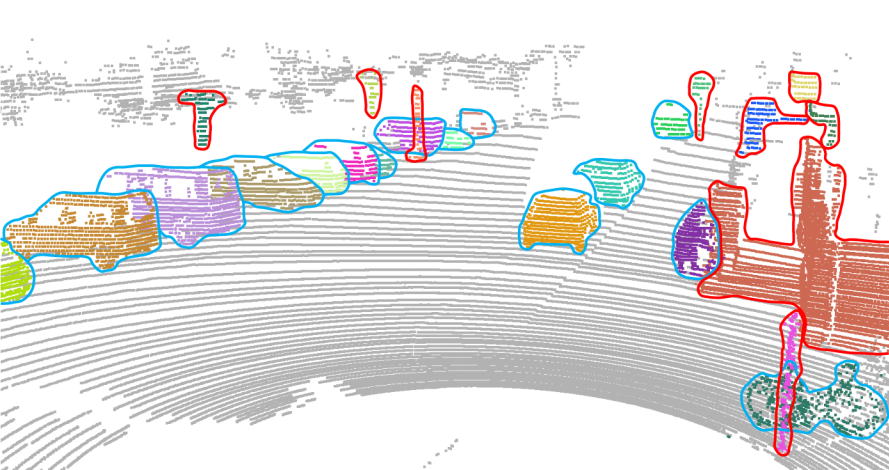
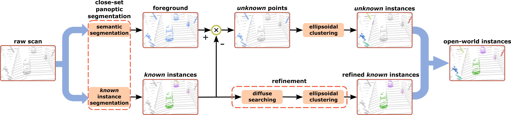

# ElC-OIS: Ellipsoidal Clustering for Open-World Instance Segmentation on LiDAR Data

This repository contains the implementation of our paper, which was accepted by IROS2023 :

> **ElC-OIS: Ellipsoidal Clustering for Open-World Instance Segmentation on LiDAR Data** [[pdf](https://arxiv.org/pdf/2303.04351.pdf)][[IEEE](https://ieeexplore.ieee.org/document/10342356)].\
> [Wenbang Deng](https://github.com/dwbzxc),  [Kaihong Huang](https://github.com/mshicom),  Qinghua Yu,  Huimin Lu,  Zhiqiang Zheng,  [Xieyuanli Chen](https://github.com/Chen-Xieyuanli)

If you use our code in your work, please star our repo and cite our paper.

```
@inproceedings{deng2023iros,
	title={{ElC-OIS: Ellipsoidal Clustering for Open-World Instance Segmentation on LiDAR Data}},
	author={Deng, Wenbang and Huang, Kaihong and Yu, Qinghua and Lu, Huimin and Zheng, Zhiqiang and Chen, Xieyuanli},
	booktitle={IEEE/RSJ International Conference on Intelligent Robots and Systems (IROS)},
        pages={7606-7613},
	year={2023}
}
```

<div align=center>
 
</div>

**Visualization of the segmentation results.** The instances circled with red lines are unknown instances, i.e., instances unlabeled in the training set. The left ones circled with blue lines are known instances, such as car, person, and bicycle.

## Overview

<div align=center>
 
</div>

**Overview of our framework.** The framework consists of three main components:
- close-set panoptic segmentation for removing the background and generating raw known instances
- unknown instance clustering for using proposed ellipsoidal clustering to segment unknown instances
- known instance refinement for using proposed diffuse searching to refine raw known instances.

## Installation
The project is tested in Ubuntu 18.04 and Ubuntu 20.04. For installation, run the following command in the root directory of this project:
```
./installation.sh
```

Then, download the close-set panoptic segmentation results of [DS-Net](https://github.com/hongfz16/DS-Net) and [Panoptic-PolarNet](https://github.com/edwardzhou130/Panoptic-PolarNet) in [OneDrive](https://1drv.ms/u/s!Ak0LoGJ7lhUTixWrbGT_3knI1F-T?e=G64YK1) or [Baidu Netdisk](https://pan.baidu.com/s/1D2d3rO4jOePgKj-LwUMccQ?pwd=ycny), **and unzip it in the root directory of this project.**

## How to run
Run the following command in the root directory:
```
python3 ois_framework.py --dataset_dir /dataset/kitti/dataset/sequences --target_set val --panoptic_segmentation_result DS-net --use_refinement
```
where `--dataset_dir` is the path of [kitti velodyne laser data sequences](https://www.cvlibs.net/datasets/kitti/eval_odometry.php).

## Dataset and benchmark

### Dataset

The close-set panoptic segmentation networks are pretrained on the SemanticKITTI [dataset](http://semantic-kitti.org/). 

### Benchmark

We evaluate our framework on the SemanticKITTI open-world LiDAR instance segmentation [benchmark](https://codalab.lisn.upsaclay.fr/competitions/2183#results). 

## Contact

Please contact us with any questions or suggestions!

Wenbang Deng: wbdeng@nudt.edu.cn and Xieyuanli Chen: xieyuanli.chen@nudt.edu.cn

## License

This project is free software made available under the MIT License. For details see the LICENSE file.

## Acknowledgments
We refer to the following open-source repository:
https://github.com/placeforyiming/ICCVW21-LiDAR-Panoptic-Segmentation-TradiCV-Survey-of-Point-Cloud-Cluster

